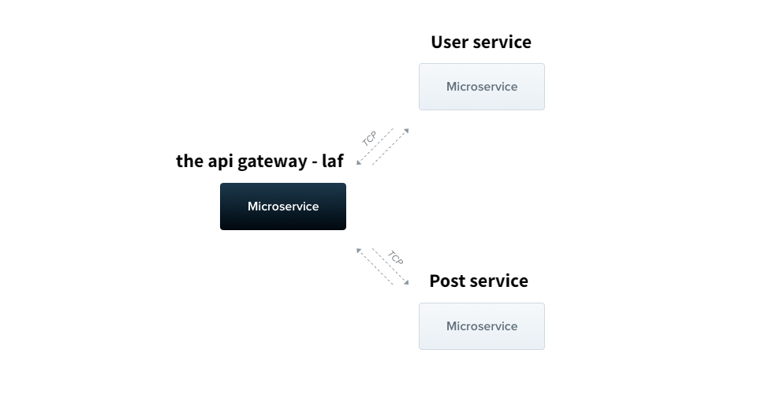

  

[circleci-image]: https://img.shields.io/circleci/build/github/nestjs/nest/master?token=abc123def456
[circleci-url]: https://circleci.com/gh/nestjs/nest

# Lost and Found Application Microservices Backend

This is the backend for a Lost and Found Application. It consists of multiple microservices that communicate with each other through TCP connections. The main entry point for the API gateway is the `LafController` in the `laf` service. The `User` and `Post` services handle user and post data respectively. `This is a simple application that demonstrates how to use NestJS to build microservices.`

## Laf Service

The `LafService` handles requests for the `LafController`. It communicates with the `User` and `Post` services through TCP connections.

#### Endpoints

- `GET api/laf` - Returns a JSON object with basic information about the API.
- All the other endpoints are forwarded to the `User` and `Post` services thru `TCP`.

## User Service

The `UserService` handles user data.

### Endpoints

- `GET api/user` - Returns a list of all users.

- `GET api/user/:id` - Returns the user with the specified `id`.

- `POST api/user` - Creates a new user.

- `PATCH api/user/:id` - Updates the user with the specified `id`.

- `DELETE api/user/:id` - Deletes the user with the specified `id`.

- `GET api/laf/user/:id/posts` - Returns the posts for the user with the specified `id`.

## Post Service

The `PostService` handles post data.

### Endpoints

- `GET api/post` - Returns a list of all posts.

- `GET api/post/unpublished` - Returns a list of all unpublished posts.

- `GET api/post/:id` - Returns the post with the specified `id`.

- `POST api/post` - Creates a new post.

- `PATCH api/post/:id` - Updates the post with the specified `id`.

- `DELETE api/post/:id` - Deletes the post with the specified `id`.

- `PATCH api/post/:id/publish` - Publishes the post with the specified `id`.

- `GET api/post/by/:authorId` - Returns a list of all posts by the author with the specified `authorId`.

## To run the microservices, please follow these steps:

1. Clone the repository to your local machine.
2. Install `Docker` on your machine, if you haven't already.
3. In the terminal, navigate to the root directory of the cloned repository.
4. Run the command `docker compose up -d` to start the microservices using the `docker-compose.yaml` file.
5. Wait for the command to finish executing.
6. Access the microservices by navigating to `http://localhost:3000` in your web browser, where `3000` is the port number specified in the `docker-compose.yaml` file. Only the `API gateway` is accessible through the web browser. The other microservices are only accessible through `TCP` connections from the `API gateway`.

## To stop the microservices, please follow these steps:

1. In the terminal, navigate to the root directory of the cloned repository.
2. Run the command `docker compose down` to stop the microservices.
3. Wait for the command to finish executing.

## PRs

PRs are welcome.
